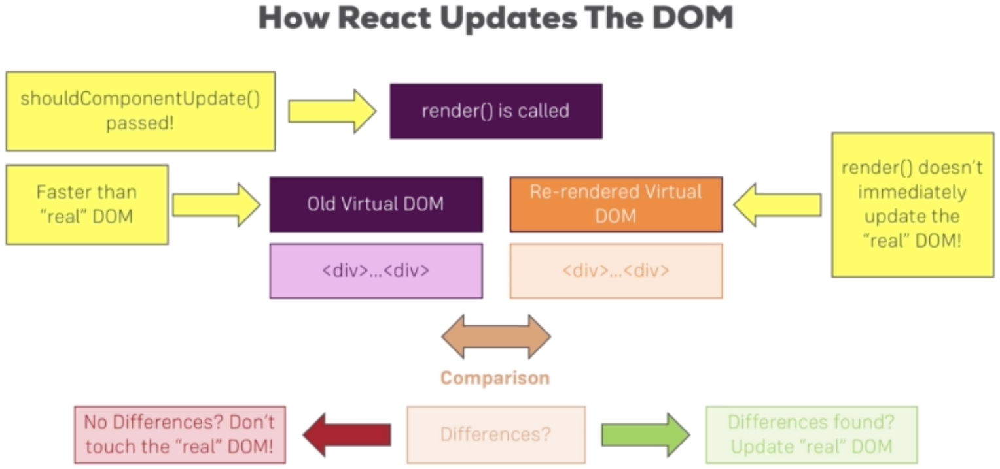

## **next-gen-js-summary**
[next-gen-js-summary](resources/pdf/components.pdf)

> JS Array Functions
>* map()  => https://developer.mozilla.org/en-US/docs/Web/JavaScript/Reference/Global_Objects/Array/map
>* find()  => https://developer.mozilla.org/en-US/docs/Web/JavaScript/Reference/Global_Objects/Array/find
>* findIndex()  => https://developer.mozilla.org/en-US/docs/Web/JavaScript/Reference/Global_Objects/Array/findIndex
>* filter()  => https://developer.mozilla.org/en-US/docs/Web/JavaScript/Reference/Global_Objects/Array/filter
>* reduce()  => https://developer.mozilla.org/en-US/docs/Web/JavaScript/Reference/Global_Objects/Array/Reduce?v=b
>* concat()  => https://developer.mozilla.org/en-US/docs/Web/JavaScript/Reference/Global_Objects/Array/concat?v=b
>* slice()  => https://developer.mozilla.org/en-US/docs/Web/JavaScript/Reference/Global_Objects/Array/slice
>* splice()  => https://developer.mozilla.org/en-US/docs/Web/JavaScript/Reference/Global_Objects/Array/splice

___

## **Quirks**
Spread operator
``` jsx
const temp1 = {
    counter: 0,
    results: []
};
console.log(temp1);

const temp2 = Object.assign({}, temp1);
temp2.counter = temp1.counter + 1;
console.log(temp2);

const temp3 = {
    ...temp1, // spread temp1 properties
    counter: temp1.counter + 1 // Add new property, however it was present in old state - overrides property (counter in this example) from temp1 with new value
}
console.log(temp3);
```

Push vs Concat
push - manipulates old array
concat - return new updated array (i.e old array + new added element)
___


## **REACT**

[Component](resources/pdf/components.pdf)

> Component is just a function returning some jsx
``` jsx
import React from 'react'; // When using jsx, we need to import react

const person = () => {
    return  <p>I'm a Person!</p>
};

export default person;
```
``` jsx
import React, { Component } from 'react';
import './App.css';
import Person from './Person';  // importing component

class App extends Component {
  render() {
    return (
      <div className="App">
        <h1>Hi, I'm a React App</h1>
        <Person/>   {/* using component*/}
      </div>
    );
  }
}
export default App;
```
____

> Outputting dynamic content in jsx
>* use **{** js code here **}**

___

## **Props and State**
[Props & State](resources/pdf/props-state.pdf)


> When using class-based components it's this.props
``` jsx
class App extends Component {
  render() {
    return (<p>My name is {this.props}</p>);
  }
}
```

> Working with props (inside tag)
``` jsx
class App extends Component {
  render() {
    return (
      <div className="App">
        <h1>Hi, I'm a React App</h1>
        <Person name="Max" age="30"/>
        <Person name="Mary" age="28">Some text for person</Person>
        <Person name="Ted" age="15"/>
      </div>
    );
  }
}
```
``` jsx
import React from 'react';
const person = (props) => {
    return  <p>I'm a {props.name} and I am {props.age} years old!</p>
};
export default person;
```

> Working with props (children property)
>* children refers to any element between the opening and closing tag of our component
``` jsx
class App extends Component {
  render() {
    return (
      <div className="App">
        <h1>Hi, I'm a React App</h1>
        <Person name="Max" age="30"/>
        <Person name="Mary" age="28">Some text for person</Person>
        <Person name="Ted" age="15"/>
      </div>
    );
  }
}
```
``` jsx
import React from 'react';
const person = (props) => {
    return  (
        <div>
            <p>I'm a {props.name} and I am {props.age} years old!</p>
            <p>{props.children}</p>
        </div>
    )
};
export default person;
```
___

> this refer to class

___

> To Which Events Can You Listen?
https://reactjs.org/docs/events.html#supported-events

___

## **Understanding State**
[State](resources/pdf/state-learning.pdf)

> State is managed from inside a component
> State is js object
> On state change - dom will re-render

> Manipulating state
>* We should not mutate state directly
``` jsx
~~this.state.persons[0].name = "Maxi"~~
```
>* use this.setState
``` jsx
this.setState({
      persons: [
        {name: 'Maximillian', age: 28}
      ]
    });
```

## **using setState() hook**
[user-state-hook](resources/pdf/use-state-hook.pdf)

> useState -> return two things
> 1. personsState -> give you access to the state
> 2. setPerstonState -> function however it replace the state - doesn't do any merge - need to manually copy from other state
``` jsx
import React, { useState } from 'react';
import './App.css';
import Person from './Person/Person';

// class App extends Component {
const app = props =>{
    const [personsState, setPersonsState] = useState({
      persons: [
        {name: 'Max', age: 28},
        {name: 'Manu', age: 29},
        {name: 'Stepanie', age: 26}
      ] //,
      // otherState: 'some other value'
    });

    // However the more elegant way is to use multiple useState to manage state
    const [otherState, setOtherState] = useState({text: 'some other value'});

    console.log(personsState, otherState);

    const switchNameHandler = () => {
      setPersonsState({
        persons: [
          {name: 'Maximillian', age: 28},
          {name: 'Manu', age: 29},
          {name: 'Stepanie', age: 27}
        ],
        // otherSate: personsState.otherState // -> manually adding it
      });
    };

    return (
      <div className="App">
        <h1>Hi, I'm a React App</h1>
        <button onClick={switchNameHandler}>Switch Name</button>
        <Person name={personsState.persons[0].name} age={personsState.persons[0].age}/>
        <Person name={personsState.persons[1].name} age={personsState.persons[1].age}>Some text for person</Person>
        <Person name={personsState.persons[2].name} age={personsState.persons[2].age}/>
      </div>
    );
}

// export default App;
export default app;
```
___

## **Stateful vs Stateless Components**
> stateful (container) -> component that manages states
> stateless (dumb components) -> functional components that doesn't use state; even (react16) though we can do it now with hooks

|class-based|functional|
|---|---|
|class XY extends Component|const XY = props => {...}|
|access to state|access to state(useState())|
|lifecycle hooks|not supported|
|access state and props via 'this'|access props via "props"|
|this.state.XY & this.props.XY|props.XY|

> Use class-based -> if you need to manage State or access to lifecycle hooks and you don't want to use React Hooks!
> Use functional -> use in all cases


___

## **Passing methods references between components**
> 1. use .bind(this, parameters) - preferred react won't render unnecessarily
``` jsx
<button onClick={this.switchNameHandler.bind(this, "Maxi")}>Switch Name</button>
```
> 2. pass anonymous function - however not every efficient
``` jsx
<button onClick={() => this.switchNameHandler('Maximillian')}>Switch Name</button> 
```
___

## **Two way binding**

``` jsx
nameChangeHandler = (event) => {
    this.setState({
      persons: [
        { name: event.target.value, age: 29 },
      ]
    });
  };

render() {
    return (
      <div className="App">
        <h1>Hi, I'm a React App</h1>
        <Person
          name={this.state.persons[1].name}
          age={this.state.persons[1].age}
          click={this.switchNameHandler.bind(this, "Maxi")}
          changed={this.nameChangeHandler}>My Hobbies: Racing</Person>
      </div>
    );
}
```
> 1. display -> value={props.name}
> 2. onChange -> call function (this.nameChangeHandler) from props

``` jsx 
import React from 'react';

const person = (props) => {
    return  (
        <div>
            <p onClick={props.click}>I'm a {props.name} and I am {props.age} years old!</p>
            <p>{props.children}</p>
            <input type="text" onChange={props.changed} value={props.name}></input>
        </div>
    )
};

export default person;
```

## **Styling and Stylesheet**
> 1. Importing css
``` jsx
import './Person.css';
```
> 2. Inline style
``` jsx
render() {
    const style ={
      backgroundColor: 'white',
      font: 'inherit',
      border: '1px solid blue',
      padding: '8px',
      cursor: 'pointer'
    };

    return (
      <div className="App">
        <h1>Hi, I'm a React App</h1>
        <p>This is really working!</p>
        <button style={style}
                onClick={() => this.switchNameHandler()}>Switch Name</button>
      </div>
    );
  }
```

___

no block statement in jsx only oneline e.g ternary operator eligible but not if else statements
___

Handling dynamic content "The JS way"
> Ternary op not optimal
> Every time reactjs render() it will process all code before return(), there can add code before return() for processing

___

## **Outputting List**
> Use js map()
``` jsx
<div>
    {this.state.persons.map((persons, index) => {
        return <Person 
        click={() => this.deletePersonHandler(index)}
        name={persons.name}
        age={persons.age} />
    })}
</div> 
```
___

## **Immutability**
https://academind.com/learn/javascript/reference-vs-primitive-values/
> **We should update state in a immutable fashion**
> If not, we are passing as reference and mutating it
``` jsx
const persons = this.state.persons;
// -> any other operations here on persons is mutating the original array leading to wierd effects
```
> 1. use slice() to make a copy of a list
``` jsx
const persons = this.state.persons.slice();
```
> 2. use spread operation
``` jsx
const persons = [...this.state.persons];
```

___

## **Lists and Keys**
> key prop required
> helps react update list efficiently
``` jsx
{this.state.persons.map((persons, index) => {
    return <Person 
    click={() => this.deletePersonHandler(index)}
    name={persons.name}
    age={persons.age} 
    key={person.id}/>  // usually passed id
})}
```
___

## **Immutable process to update an object in an array**
``` jsx
nameChangeHandler = (event, id) => {
    // could have used indexOf() here
    // I'm finding the index of the person to be updated
    const personIndex = this.state.persons.findIndex(p => {
      return p.id  === id;
    })

    // another way - old
    // const person = Object.assign({}, this.state.persons[personIndex]);

    // getting copy of objects
    // get a copy of the person object
    const person = {
      ...this.state.persons[personIndex]}
    ;

    // change name of the person object
    person.name = event.target.value;

    // get a copy of the persons array
    const persons = [...this.state.persons];
    // update the person object from the persons array to the updated one
    persons[personIndex] = person;

    // updating old persons array with the new copy
    this.setState({persons: persons});
};
```

## **Styling**
> Setting class dynamically - using js

> Use radium (npm) for more complex css e.g css pseudo classes

> Import radium StyleRoot for media queries

## **npm run eject**
> config folder -> configuration files, mainly webpack
> scripts folders -> have files for each command in the package.json

## **CSS Module**
> Imported css files need to end with "*.module.css"

## **Pseudo Selectors**
> Use css modules and will work

___

## **Debugging**
> Use error boundary - mainly for dev

___

## **React Components and Internals**
> Components vs Container

> Can return a list without divs
> Otherwise, we need divs

___

## **Lifecycle Hooks has absolutely NOTHING to do with React Hooks**
___

## **Component Lifecycle**
> Only available in class-based components

|class-based components|Desc|
|---|---|
|constructor()||
|getDerivedStateFromPost()||
|shouldComponentUpdate()||
|getSnapshotBeforeUpdate()||
|componentDidUpdate()||
|componentDidCatch()||
|componentDidMount()||
|componentWillUnmount()||
|render()||


## **Lifecycle - classed based**
[lifecycle-creation-learning-card](lifecycle-creation-learning-card.pdf)

[lifecycle-update-external-learning-card](lifecycle-update-external-learning-card.pdf)


> Lifecycle for props changes 
``` jsx
static getDerivedStateFromProps(props, state){return state}

// condition on whether to update of not
shouldComponentUpdate(nextProps, nextState){return true}

// Legacy hooks
// componentWillReceiveProps(props){...}

getSnapshotBeforeUpdate(nextProps, nextState){return obj}

// Legacy hooks
// componentWillUpdate(){}

componentDidUpdate(prevProps, prevState, snapshot){...}
```

> Lifecycle for state changes 
``` jsx
shouldComponentUpdate(nextProps, nextState){return true;}

componentDidUpdate(){}
```


## **Lifecycle - functional component**
> Use useEffect from react
> it runs after the render() method
``` jsx
import React, {useEffect} from "react";
```

> pass a function to it
``` jsx
useEffect(() => {
  console.log('[Cockpit.js] useEffect');
});
```

> useEffect runs on every update
> even on first render

> Controlling useEffect behavior
``` jsx
useEffect(() => {
  console.log('[Cockpit.js] useEffect');
  // http request ...
  setTimeout(() => {
    alert('Saved data to cloud!');
  }, 1000);
}, [props.persons]);  // pass what needs to change to trigger
```
> Run only once 
``` jsx
useEffect(() => {
  console.log('[Cockpit.js] useEffect');
  // http request ...
  setTimeout(() => {
    alert('Saved data to cloud!');
  }, 1000);
}, []);  // pass empty array - will run once but won't re-run as no object is specify for re-run, this the empty array
```

> Clean up work 
>* Class based
``` jsx
componentWillUnmount(){}
```
> Functional
> Here it runs BEFORE the main useEffect function runs, but AFTER the (first) render cycle!
``` jsx
useEffect(() => {
  console.log('[Cockpit.js] useEffect');
  // http request ...
  setTimeout(() => {
    alert('Saved data to cloud!');
  }, 1000);
  return () => {
    console.log('[Cockpit.js] cleanup work in useEffect');
  }
}, []);  // -> [] is for when component gets destroyed
```

> Run cycle
``` jsx
useEffect(() => {
  console.log("[Cockpit.js] 2nd useEffect");
  return () => {
    console.log("[Cockpit.js] cleanup work in 2nd useEffect");
  };
});
```
> First run
``` jsx
[Cockpit.js] 2nd useEffect
```
> Second run
``` jsx
[Cockpit.js] cleanup work in 2nd useEffect  // -> return runs first 
[Cockpit.js] 2nd useEffect
```

___


## **Performance optimization**
> class based component - shouldComponentUpdate()
``` jsx
shouldComponentUpdate(nextProps, nextState){
  console.log('[Persons.js] shouldComponentUpdate');
  if (nextProps.persons !== this.props.persons){
    return true;
  } else {
    return false;
  }
}
```

> functional component - use React.memo();
``` jsx
export default React.memo(cockpit);
```
___

## **PureComponent**
> With purecomponent we do not need to implement shouldComponentUpdate() with all the checks - it automatically does it
> Instead of doing this:
``` jsx
shouldComponentUpdate(nextProps, nextState){
  console.log('[Persons.js] shouldComponentUpdate');
  console.log(nextProps);
  console.log(nextState);
  if (
    nextProps.persons !== this.props.persons ||
    nextProps.changed !== this.props.changed ||
    nextProps.click !== this.props.click 
  ){
    return true;
  } else {
    return false;
  }
}
```
> We do this:
``` jsx
import React, { PureComponent } from "react";

class Persons extends PureComponent {...}

export default Persons;
```

___

## **How react updates the real dom**



___


## **Rendering Adjacent JSX Elements**
[react-adjacent-jsx](resources/pdf/react-adjacent-jsx.pdf)

> By default javascript wants/allows you to return only one expression <div>
``` jsx
return (
  // main div here
  <div className={classes.Person}> 
    <p onClick={this.props.click}>
      I'm a {this.props.name} and I am {this.props.age} years old!
    </p>
    <p>{this.props.children}</p>
    <input type="text" onChange={this.props.changed} value={this.props.name} />
  </div>
);
```

> Actually react allows us to return an array of element as long as they have a key
``` jsx
render() {
  console.log("[Person.js] render");
  // returning array [] below rather than ()
  return [
      <p key="i1" onClick={this.props.click}>
        I'm a {this.props.name} and I am {this.props.age} years old!
      </p>,
      <p key="i2">{this.props.children}</p>,
      <input key="i3" type="text" onChange={this.props.changed} value={this.props.name} />     
  ];
}
```

> Using higher order component (hoc)
> Just create an empty component and return the children
``` jsx
// import React from 'react'; -> no need to import React as we are not using jsx
const aux = props => props.children;  
export default aux;  // on windows avoid aux (reserver word) - use something else e.g auxiliary
```
``` jsx
return (
  <Aux> 
    <p onClick={this.props.click}>
      I'm a {this.props.name} and I am {this.props.age} years old!
    </p>
    <p>{this.props.children}</p>
    <input
      type="text"
      onChange={this.props.changed}
      value={this.props.name}
    />
  </Aux>
);
```

> Now we have build-in component/wrapper, no need to custom build one, just use <React.Fragment> instead
``` jsx
return (
  <React.Fragment>
    <p onClick={this.props.click}>
      I'm a {this.props.name} and I am {this.props.age} years old!
    </p>
    <p>{this.props.children}</p>
    <input
      type="text"
      onChange={this.props.changed}
      value={this.props.name}
    />
  </React.Fragment>
);
```
> Our just import the Fragment compoment
``` jsx
import React, { Component, Fragment } from "react";
```
> and then
``` jsx
return (
  <Fragment>
    <p onClick={this.props.click}>
      I'm a {this.props.name} and I am {this.props.age} years old!
    </p>
    <p>{this.props.children}</p>
    <input
      type="text"
      onChange={this.props.changed}
      value={this.props.name}
    />
  </Fragment>
);
```

____

## **Higher Order Function (HOC)**
> Component that wraps other component to add things to it
> e.g styling, http error handling, additional html, additional logic

>* Method 1 - better for styling, additional html
``` jsx
import React from "react";
const withClass = props => (
  <div className={props.classes}>{props.children}</div>
);
export default withClass;
```

>* Method 2 - added logic
>* First argument -> WrappedComponent -> needs to start with Capital Letters because it will be a reference to a component
>* 2nd argument -> is what you need in you hoc, can accept as many other arguments as we need for the hoc

``` jsx
import React from "react";
// This is a normal function that returns a react component function
const withClass = (WrappedComponent, className) => {
  {/* return react component */}
  return props => (
    <div className={className}>
      <WrappedComponent />  {/* what the WrappedComponent return is injected here */}
    </div>
  );
};
export default withClass;
```

``` jsx
import React, { Component } from "react";
import classes from "./App.module.css";
...
import withClass from "../hoc/withClass";
import Aux from "../hoc/Aux";

class App extends Component {
  ... constructor, lifecycle event function, other functions and etc
  render() {
    ... other logic here
    return (
      <Aux>
        .... jsx here
      </Aux>
    );
  }
}

export default withClass(App, classes.App); 
```
___

## **Passing unknown props**
> pass the destructured props
``` jsx
const withClass = (WrappedComponent, className) => {
  return props => (
    <div className={className}>
      <WrappedComponent {...props}/>  {/* destructuring using spread operators */}
    </div>
  );
};
```

___


## **Setting state correctly**
> Calling this.setSate({obj to be updated}) -> does not guarantee that the object will be updated.  React will decide when it's ready to do so.
> Calling this.state.variable -> does not guarantee it is the latest changed variable

> Best way to do it is to pass an anonymous function to this.setState;
> Recommended way (not optional - best pattern) when depending on old state
``` jsx
this.setState((prevState, props) => {
  return { 
    persons: persons, 
    changeCounter:  prevState.changeCounter + 1
  }
});
```
___

## **Using PropTypes**
> npm install prop-types -> from react official team but not integrated in react core lib
> works on both functional and class based components
``` jsx
import React, { Component } from "react";
import PropTypes from 'prop-types';
import classes from "./Person.module.css";
import Aux from "../../../hoc/Aux";
import withClass from '../../../hoc/withClass';

class Person extends Component {
  render() {
    console.log("[Person.js] render");
    return (
      <Aux>
        <p onClick={this.props.click}>
          I'm a {this.props.name} and I am {this.props.age} years old!
        </p>
        <p>{this.props.children}</p>
        <input
          type="text"
          onChange={this.props.changed}
          value={this.props.name}
        />
      </Aux>
    );
  }
}

// Defining types for the props
Person.propTypes = {
  click: PropTypes.func,
  changed: PropTypes.func,
  name: PropTypes.string,
  age: PropTypes.number
};

export default withClass(Person, classes.Person);
```
___


## **Using Refs - class based components**
> access jsx element - without 2 way binding
> ref is like key - special react element

> Method 1
``` jsx
class Person extends Component {

  componentDidMount(){
    this.inputElement.focus();
  }

  render() {
    console.log("[Person.js] render");
    return (
      <Aux>
        ...
        <input
          type="text"
          ref={(inputEl) => {this.inputElement = inputEl}}
          onChange={this.props.changed}
          value={this.props.name}
        />
      </Aux>
    );
  }
}
```

> Method 2 - using constructor - React.createRef()
``` jsx
class Person extends Component {
  constructor(props){
    super(props);
    this.inputElementRef = React.createRef();
  }

  componentDidMount(){
    this.inputElementRef.current.focus();
  }

  render() {
    console.log("[Person.js] render");
    return (
      <Aux>
        ...
        <input
          type="text"
          ref={this.inputElementRef}
          onChange={this.props.changed}
          value={this.props.name}
        />
      </Aux>
    );
  }
}
```

___

## **Using Refs - functional components**
> Import useRef 
``` jsx
Import React, { useEffect, useRef } from "react";
...

const cockpit = props => {
  const toggleBtnRef = useRef(null);

  useEffect(() => {
    console.log("[Cockpit.js] useEffect");
    toggleBtnRef.current.click();
    return () => {
      console.log("[Cockpit.js] cleanup work in useEffect");
    };
  }, []);
  ...
  return (
    <div className={classes.Cockpit}>
      ...
      <button ref={toggleBtnRef} className={btnClass} onClick={props.clicked}>
        Switch Name
      </button>
    </div>
  );
};

export default React.memo(cockpit);

```
___

## **Prop chains problems**
> Use createcContext() - to bypass middle compoments
> Make obj, array, string, number etc available without using props

``` jsx
import React from 'react';
const authContext = React.createContext({
    authenticated: false,
    login: () => {}
});
export default authContext;
```

``` jsx
...
import AuthContext from "../context/auth-context";

class App extends Component {
  ...
  state = {
    ...
    authenticated: false
  };

  ...

  loginHandler = () => {
    this.setState({ authenticated: true });
  };

  render() {
    ...
    return (
      <Aux>
        ...
        <AuthContext.Provider
          value={{
            authenticated: this.state.authenticated, // state ref
            login: this.loginHandler // function ref
          }} // first {} is for dynamic content, second{} object that will be available to the consumers
        >
          {this.state.showCockpit ? (
            <Cockpit
              title={this.props.appTitle}
              personsLength={this.state.persons.length}
              showPersons={this.state.showPersons}
              clicked={this.togglePersonsHandler}
            />
          ) : null}
          {persons}
        </AuthContext.Provider>
      </Aux>
    );
  }
}

export default withClass(App, classes.App);
```
> Bypassing Persons.js, go straight to Person.js
``` jsx
...
import AuthContext from "../../../context/auth-context";

class Person extends Component {
  ...
  render() {
    console.log("[Person.js] render");
    return (
      <Aux>
        <AuthContext.Consumer>
          {(context) => context.authenticated ? <p>Authenticated!</p> : <p>Please login</p>}
        </AuthContext.Consumer>
        ...
      </Aux>
    );
  }
}
```

``` jsx
...
import AuthContext from '../../context/auth-context';

const cockpit = props => {
  ...
  return (
    <div className={classes.Cockpit}>
      ...
      <AuthContext.Consumer>
        {(context) => <button onClick={context.login}>Log in</button>}
      </AuthContext.Consumer>
    </div>
  );
};
...
```
___

## **More elegant way than above**
> context only accessible from jsx
> Classed based components - use "static contextType"
``` jsx
...
import AuthContext from "../../../context/auth-context";

class Person extends Component {
  ...

  // need to be "static" and variable "contextType" should be as is otherwise won't work
  static contextType = AuthContext;

  componentDidMount(){
    this.inputElementRef.current.focus();
    console.log(this.context.authenticated);
  }

  render() {
    console.log("[Person.js] render");
    return (
      <Aux>
        {this.context.authenticated ? <p>Authenticated!</p> : <p>Please login</p>}
        ...
      </Aux>
    );
  }
}
...
```

> Functional components - use "useContext"
``` jsx
import React, { useEffect, useRef, useContext } from "react";
...
import AuthContext from '../../context/auth-context';

const cockpit = props => {
  ...
  const authContext = useContext(AuthContext);
  ...
  return (
    <div className={classes.Cockpit}>
      ...
      <button onClick={authContext.login}>Log in</button>
    </div>
  );
};
```

____

> More on useEffect(): https://reactjs.org/docs/hooks-effect.html

> State & Lifecycle: https://reactjs.org/docs/state-and-lifecycle.html

> PropTypes: https://reactjs.org/docs/typechecking-with-proptypes.html

> Higher Order Components: https://reactjs.org/docs/higher-order-components.html

> Refs: https://reactjs.org/docs/refs-and-the-dom.html
____


## **Planning a React App**
> Component Tree / Component Structure
> Application State(Data)
> Components (stateless) vs Containers (stateful)


____

[...Array(2)] -> creates any array of 2 empty element;

___

## **http / ajax**
> componentDidMount() -> best place to send http request

## **axios**
> axios Interceptors - like AOP
``` javascript
axios.interceptors.request.use((request) => {
    console.log(request);
    // Edit request config
    return request;
}, error => {
    console.log(error);
    return Promise.reject(error);
});

axios.interceptors.response.use((response) => {
    console.log(response);
    // Edit response config
    return response;
}, error => {
    console.log(error);
    return Promise.reject(error);
});
```

Removing Interceptors
Section 9, Lecture 196
You learned how to add an interceptor, getting rid of one is also easy. Simply store the reference to the interceptor in a variable and call eject  with that reference as an argument, to remove it (more info: https://github.com/axios/axios#interceptors):
``` javascript
var myInterceptor = axios.interceptors.request.use(function () {/*...*/});
axios.interceptors.request.eject(myInterceptor);
```
___

## **Routing**


> npm install --save react-router react-router-dom
___

```
react-router vs react-router-dom
Section 11, Lecture 215
We installed both react-router  and react-router-dom . Technically, only react-router-dom  is required for web development. It wraps react-router  and therefore uses it as a dependency. 

We don't need to install react-router  on our own for it to work. You can omit this installation step, I left it in there for historic reasons and because I like to emphasize that the main package is named react-router. If you ever search for assistance, you probably want to search for "react router" - that's the name of the package.
```
___

> Use {BrowserRouter}
``` jsx
import React, { Component } from "react";
import { BrowserRouter } from "react-router-dom";
import Blog from "./containers/Blog/Blog";

class App extends Component {
  render() {
    return (
      <BrowserRouter>
        <div className="App">
          <Blog />
        </div>
      </BrowserRouter>
    );
  }
}

export default App;
```
> Use {Route}
``` jsx
import {Route} from 'react-router-dom';
```
``` jsx
class Blog extends Component {
  render() {
    return (
      <div className="Blog">
        ...
        <Route path="/" exact render={() => <h1>Home</h1>} />
        <Route path="/" render={() => <h1>Home2</h1>} />
      </div>
    );
  }
}
```
> With exact the full path needs to be "/"
> Without exact - means path need to start with "/"
___
> render{() => jsx_code} -> use render for jsx code
> component={Posts} -> use component for react components
``` jsx
<Route path="/" exact component={Posts} />
```
___

## **Prevent reloading - using links to switch pages**
> When we reload - we lose the state of the application
> use {Link}
``` jsx
<ul>
  <li>
    <Link to="/">Home</Link>
  </li>
  <li>
  <Link to={{
      pathname: "/new-post",
      hash: '#submit', // use to jump to point on page
      search: '?quick-submit=true'
  }}>New Post</Link>
  </li>
</ul>
```
> components not directly generated by route don't get the route props.. just the std props
> Method 1 - need to pass them along
``` jsx
return (
  <Post
    key={post.id}
    clicked={() => this.postSelectedHandler(post.id)}
    title={post.title}
    {...this.props} // passing route props here
    author={post.author}
  />
);
```
> Method 2 - use {withRouter} to make component route aware
``` jsx
import { withRouter } from 'react-router-dom';

const post = props => {
  return (
    ...
  );
};

export default withRouter(post);
```

## **Absolute vs Relative path**
> absolute path jumps straight to to after the baseurl
> default setup
> e.g amazon.com/home to amazon.com/new-post

> relative path - need to dynamically build it
``` jsx
 <Link to={{
    pathname: this.props.match.url + "/new-post" // -> dynamically building the path
}}>New Post</Link>
```
``` text
Absolute vs Relative Paths (Article)
Section 11, Lecture 224
You learned about <Link> , you learned about the to  property it uses.

The path you can use in to can be either absolute or relative. 

Absolute Paths
By default, if you just enter to="/some-path"  or to="some-path" , that's an absolute path. 

Absolute path means that it's always appended right after your domain. Therefore, both syntaxes (with and without leading slash) lead to example.com/some-path .

Relative Paths
Sometimes, you might want to create a relative path instead. This is especially useful, if your component is already loaded given a specific path (e.g. posts ) and you then want to append something to that existing path (so that you, for example, get /posts/new ).

If you're on a component loaded via /posts , to="new"  would lead to example.com/new , NOT example.com/posts/new . 

To change this behavior, you have to find out which path you're on and add the new fragment to that existing path. You can do that with the url  property of props.match :

<Link to={props.match.url + '/new'}>  will lead to example.com/posts/new  when placing this link in a component loaded on /posts . If you'd use the same <Link>  in a component loaded via /all-posts , the link would point to /all-posts/new .

There's no better or worse way of creating Link paths - choose the one you need. Sometimes, you want to ensure that you always load the same path, no matter on which path you already are => Use absolute paths in this scenario.

Use relative paths if you want to navigate relative to your existing path.
```
___

## **Styling routes**
> Use {NavLink}
___

## **Passing route parameters**

``` text
Parsing Query Parameters & the Fragment
Section 11, Lecture 228
You learned how to extract route parameters (=> :id  etc). 

But how do you extract search (also referred to as "query") parameters (=> ?something=somevalue  at the end of the URL)? How do you extract the fragment (=> #something  at the end of the URL)?

Query Params:
You can pass them easily like this:

<Link to="/my-path?start=5">Go to Start</Link> 

or

<Link 
    to={‌{
        pathname: '/my-path',
        search: '?start=5'
    }}
    >Go to Start</Link>
React router makes it easy to get access to the search string: props.location.search .

But that will only give you something like ?start=5 

You probably want to get the key-value pair, without the ?  and the = . Here's a snippet which allows you to easily extract that information:

componentDidMount() {
    const query = new URLSearchParams(this.props.location.search);
    for (let param of query.entries()) {
        console.log(param); // yields ['start', '5']
    }
}
URLSearchParams  is a built-in object, shipping with vanilla JavaScript. It returns an object, which exposes the entries()  method. entries()  returns an Iterator - basically a construct which can be used in a for...of...  loop (as shown above).

When looping through query.entries() , you get arrays where the first element is the key name (e.g. start ) and the second element is the assigned value (e.g. 5 ).

Fragment:
You can pass it easily like this:

<Link to="/my-path#start-position">Go to Start</Link> 

or

<Link 
    to={‌{
        pathname: '/my-path',
        hash: 'start-position'
    }}
    >Go to Start</Link>
React router makes it easy to extract the fragment. You can simply access props.location.hash .
```
___

> Use {switch} to have only one path rendered.
> Order is important - first match will be used to render
``` jsx
<Route path="/" exact component={Posts} />
<Switch>
  <Route path="/new-post" component={NewPost} />
  <Route path="/:id" exact component={FullPost} />
</Switch>
<Route path="/test" exact component={Test} />
```
___

## **Navigating Programmatically**
> use this.props.history.push -> mostly used when an operation finishes
``` jsx
this.props.history.push('/'+id); 
```
OR
``` jsx
this.props.history.push({
  pathname: '/' + id
});
```
___

## **Nested Routes**
> 
``` jsx
// Update on routing
componentDidMount = () => {
  this.loadData();
};

// Update on new props
componentDidUpdate = () => {
  this.loadData();
};
```
> use relative paths
``` jsx
<Route path={this.props.match.url + "/:id"} exact component={FullPost} />
```

____

## **Redirecting request**
> Method 1 - use {Redirect}
``` jsx
<Switch>
  <Route path="/new-post" component={NewPost} />
  <Route path="/posts" component={Posts} />
  <Redirect from="/" to="/posts" />
</Switch>
```

> Method 2 - conditional redirection
>* Redirect used outside switch statement - we only have the "to" options
``` jsx
...
import { Redirect } from "react-router-dom";

class NewPost extends Component {
  state = {
    title: "",
    content: "",
    author: "Max",
    submitted: false
  };

  componentDidMount = () => {
    console.log(this.props);
  };

  postDataHandler = () => {
    const post = {
      title: this.state.title,
      body: this.state.body,
      author: this.state.author
    };
    axios.post(`/posts`, post).then(response => {
      console.log(response);
      this.setState({ submitted: true });
    });
  };

  render() {
    let redirect = null;

    if (this.state.redirect) {
      redirect = <Redirect to="/posts" />;
    }
    return (
      <div className="NewPost">
        {redirect}
        <h1>Add a Post</h1>
        <label>Title</label>
        ...
      </div>
    );
  }
}

export default NewPost;

```

> Method 3 - using history prop 
``` jsx
this.props.history.push("/posts");
```
``` jsx
this.props.history.replace("/posts");
```
___

## **Navigation Guards**
> In switch 
``` jsx
<Switch>
  {this.state.auth ? <Route path="/new-post" component={NewPost} /> : null}
  <Route path="/posts" component={Posts} />
  <Redirect from="/" to="/posts" /> 
</Switch>
```
> Do it on didmount()
``` jsx
componentDidMount = () => {
  // if unauth => this.props.history.replace('/posts');
};
```
___

## **404 case**
> Use route without path - need to be last and won't work with redirect "/"
``` jsx
<Switch>
  {this.state.auth ? <Route path="/new-post" component={NewPost} /> : null}
  <Route path="/posts" component={Posts} />
  <Route render={() => <h1>Not Found</h1>} /> {/* -> should come last */}
</Switch>
```

___

## **Loading routes lazily**
> code splitting or lazy loading - reactjs 4 and above 
``` jsx
import React, { Component } from "react";

const asynComponent = importComponent => {
  return class extends Component {
    state = {
      component: null
    };

    componentDidMount = () => {
      importComponent().then(cmp => {
        this.setState({ component: cmp.default });
      });
    };
    render() {
      const C = this.state.component;
      return C ? <C {...this.props} /> : null;
    }
  };
};

export default asynComponent;
```
``` jsx
...
import asynComponent from '../../hoc/aysnComponent';

// Only import when needed
const AsyncNewPost = asynComponent(() => {
  return import("./NewPost/NewPost");
});

class Blog extends Component {
  state = {
    auth: true
  }

  render() {
    return (
      <div className="Blog">
        ...
         <Switch>
          {this.state.auth ? <Route path="/new-post" component={AsyncNewPost} /> : null}
          ...
        </Switch>
      </div>
    );
  }
}

export default Blog;
```

> React > 16.6 - other way
> use {Suspense}
> Example used in routing
``` jsx
import React, { Component, Suspense } from "react";
import { BrowserRouter, Route, NavLink } from "react-router-dom";

import User from "./containers/User";
import Welcome from "./containers/Welcome";

const Posts = React.lazy(() => import("./containers/Posts"));

class App extends Component {
  render() {
    return (
      <BrowserRouter>
        <React.Fragment>
          <nav>
            <NavLink to="/user">User Page</NavLink> |&nbsp;
            <NavLink to="/posts">Posts Page</NavLink>
          </nav>
          <Route path="/" component={Welcome} exact />
          <Route path="/user" component={User} />
          <Route
            path="/posts"
            render={() => (
              <Suspense fallback={<div>Loading...</div>}>
                <Posts />
              </Suspense>
            )}
          />
        </React.Fragment>
      </BrowserRouter>
    );
  }
}

export default App;
```
> Not in route

``` jsx
import React, { Component, Suspense } from "react";
import User from "./containers/User";
const Posts = React.lazy(() => import("./containers/Posts"));

class App extends Component {
  state = {
    showPosts: false
  };
  modeHandler = () => {
    this.setState(prevState => {
      return { showPosts: !prevState.showPosts };
    });
  };
  render() {
    return (
      <React.Fragment>
        <button onClick={this.modeHandler}>Toggle Mode</button>
        {this.state.showPosts ? (
          <Suspense fallback={<div>Loading...</div>}>
            <Posts />
          </Suspense>
        ) : (
          <User />
        )}
      </React.Fragment>
    );
  }
}

export default App;
```
___

## **Routing & The Server (Deployment)**
> Server should always return html file - even 404
> add basename in <BrowserRouter> if need
``` jsx
<BrowserRouter basename="/my-app">
  <div className="App">
    <Blog />
  </div>
</BrowserRouter>
```
___

## **Passing data in path**
> Setup routes
``` jsx
<Route path={"/courses/:courseId/:courseTitle"} component={Course} />
```
> Building details in the url
``` jsx
<Link to={this.props.match.url + "/" + course.id + "/" + course.title} key={course.id}>
  <article className="Course">{course.title}</article>
</Link>
```
> Accessing the data from the params
``` jsx
<div>
    <h1>{this.props.match.params.courseTitle}</h1>
    <p>You selected the Course with ID: {this.props.match.params.courseId}</p>
</div>
```

## **Passing as query params**
> Setup routes
``` jsx
<Route path={"/courses/:courseId"} component={Course} />
```
> Building details in search
``` jsx
<Link to={{
    pathname: this.props.match.url + "/" + course.id,
    search: '?title=' + course.title
}} key={course.id}>
  <article className="Course">{course.title}</article>
</Link>
```
> Accessing the data as query params
``` jsx
state = {
    courseTitle: ''
}

componentDidMount = () => {
    const query = new URLSearchParams(this.props.location.search);
    for(let param of query.entries()){
        this.setState({courseTitle: param[1]});
    }
}

render () {
    return (
        <div>
            <h1>{this.state.courseTitle}</h1>
            <p>You selected the Course with ID: {this.props.match.params.courseId}</p>
        </div>
    );
}
```

___

## **Forms and Validation**

___

## **Redux**
[Redux](resources/pdf/redux-learning-card.pdf)

Use npm i --save redux

0. Create initial state
``` jsx
const initialState = {
    counter: 0
}
```
1. Create reducer
``` jsx

const reducer = (state = initialState, action) => {
    return state;
};
```
2. Create store
``` jsx
import { createStore } from "redux";
const store = createStore(reducer);
```

Use npm i --save react-redux

3. Connect store to react
``` jsx
import { Provider } from "react-redux";
<Provider store={store}><App /></Provider>
```

___

**Immutable update**
https://redux.js.org/recipes/structuring-reducers/immutable-update-patterns

Immutable Update Patterns
Section 14, Lecture 289
Immutable Update Patterns on reduxjs.org: http://redux.js.org/docs/recipes/reducers/ImmutableUpdatePatterns.html

Updating Nested Objects
The key to updating nested data is that every level of nesting must be copied and updated appropriately. This is often a difficult concept for those learning Redux, and there are some specific problems that frequently occur when trying to update nested objects. These lead to accidental direct mutation, and should be avoided.

Common Mistake #1: New variables that point to the same objects
Defining a new variable does not create a new actual object - it only creates another reference to the same object. An example of this error would be:

``` jsx
function updateNestedState(state, action) {
    let nestedState = state.nestedState;
    // ERROR: this directly modifies the existing object reference - don't do this!
    nestedState.nestedField = action.data;
 
    return {
        ...state,
        nestedState
    };
}
```

This function does correctly return a shallow copy of the top-level state object, but because the nestedState variable was still pointing at the existing object, the state was directly mutated.

Common Mistake #2: Only making a shallow copy of one level
Another common version of this error looks like this:

``` jsx
function updateNestedState(state, action) {
    // Problem: this only does a shallow copy!
    let newState = {...state};
 
    // ERROR: nestedState is still the same object!
    newState.nestedState.nestedField = action.data;
 
    return newState;
}
```

Doing a shallow copy of the top level is not sufficient - the nestedState object should be copied as well.

Correct Approach: Copying All Levels of Nested Data
Unfortunately, the process of correctly applying immutable updates to deeply nested state can easily become verbose and hard to read. Here's what an example of updating state.first.second[someId].fourth might look like:

``` jsx
function updateVeryNestedField(state, action) {
    return {
        ...state,
        first : {
            ...state.first,
            second : {
                ...state.first.second,
                [action.someId] : {
                    ...state.first.second[action.someId],
                    fourth : action.someValue
                }
            }
        }
    }
}
```
Obviously, each layer of nesting makes this harder to read, and gives more chances to make mistakes. This is one of several reasons why you are encouraged to keep your state flattened, and compose reducers as much as possible.

Inserting and Removing Items in Arrays
Normally, a Javascript array's contents are modified using mutative functions like push, unshift, and splice. Since we don't want to mutate state directly in reducers, those should normally be avoided. Because of that, you might see "insert" or "remove" behavior written like this:
``` jsx
function insertItem(array, action) {
    return [
        ...array.slice(0, action.index),
        action.item,
        ...array.slice(action.index)
    ]
}
 
function removeItem(array, action) {
    return [
        ...array.slice(0, action.index),
        ...array.slice(action.index + 1)
    ];
}
```
However, remember that the key is that the original in-memory reference is not modified. As long as we make a copy first, we can safely mutate the copy. Note that this is true for both arrays and objects, but nested values still must be updated using the same rules.

This means that we could also write the insert and remove functions like this:
``` jsx
function insertItem(array, action) {
    let newArray = array.slice();
    newArray.splice(action.index, 0, action.item);
    return newArray;
}
 
function removeItem(array, action) {
    let newArray = array.slice();
    newArray.splice(action.index, 1);
    return newArray;
}
```
The remove function could also be implemented as:
``` jsx
function removeItem(array, action) {
    return array.filter( (item, index) => index !== action.index);
}
```
Updating an Item in an Array
Updating one item in an array can be accomplished by using Array.map, returning a new value for the item we want to update, and returning the existing values for all other items:
``` jsx
function updateObjectInArray(array, action) {
    return array.map( (item, index) => {
        if(index !== action.index) {
            // This isn't the item we care about - keep it as-is
            return item;
        }
 
        // Otherwise, this is the one we want - return an updated value
        return {
            ...item,
            ...action.item
        };    
    });
}
```
Immutable Update Utility Libraries
Because writing immutable update code can become tedious, there are a number of utility libraries that try to abstract out the process. These libraries vary in APIs and usage, but all try to provide a shorter and more succinct way of writing these updates. Some, like dot-prop-immutable, take string paths for commands:
``` jsx
state = dotProp.set(state, `todos.${index}.complete`, true)
```
Others, like immutability-helper (a fork of the now-deprecated React Immutability Helpers addon), use nested values and helper functions:
``` jsx
var collection = [1, 2, {a: [12, 17, 15]}];
var newCollection = update(collection, {2: {a: {$splice: [[1, 1, 13, 14]]}}});
```
They can provide a useful alternative to writing manual immutable update logic.
___

**Understanding State Types**
[state-types](resources/pdf/state-types.pdf)

___

## **Advanced Redux**

Middleware
``` jsx
import React from "react";
import ReactDOM from "react-dom";
import { createStore, combineReducers, applyMiddleware } from "redux";
import { Provider } from "react-redux";
import "./index.css";
import App from "./App";
import * as serviceWorker from "./serviceWorker";
import counterReducer from "./store/reducers/counter";
import resultReducer from "./store/reducers/result";

const rootReducer = combineReducers({
    ctr: counterReducer,
    res: resultReducer
});

const logger = (store) => {
    return next => {
        return action => {
            console.log('[Middleware] Dispatching', action);
            const result = next(action);
            console.log('[Middleware] next state', store.getState());
            return result;
        }
    }
};

const store = createStore(rootReducer, applyMiddleware(logger));

ReactDOM.render(<Provider store={store}><App /></Provider>, document.getElementById("root"));

serviceWorker.unregister();
```

React DevTools
https://github.com/zalmoxisus/redux-devtools-extension

Setup
``` jsx
...
import { createStore, combineReducers, applyMiddleware, compose } from "redux";
...
const composeEnhancers = window.__REDUX_DEVTOOLS_EXTENSION_COMPOSE__ || compose;

const store = createStore(rootReducer, composeEnhancers(applyMiddleware(logger)));
...
```

## **Action Creators**
Define Action Creators - Outsource action 
``` jsx
export const increment = () => {
  return {
    type: INCREMENT
  };
};
...
export const deleteResult = resElId => {
  return {
    type: DELETE_RESULT,
    resultElId: resElId
  };
};
```
Access Action Creators - import and call function
``` jsx
import * as actionCreators from '../../store/actions/actions';
...
const mapDispatchToProps = dispatch => {
    return {
        onIncrementCounter: () => dispatch(actionCreators.increment()),
        ...
        onDeleteResult: (id) => dispatch(actionCreators.deleteResult(id))
    };
};
```

## **Executing Async Code**
SETUP
Use npm i --save redux-thunk

``` jsx
...
import thunk from "redux-thunk";
...
const store = createStore(rootReducer, composeEnhancers(applyMiddleware(logger, thunk)));
...
```


It dispatch a function rather than the action itself. 
``` jsx
// sync code
export const saveResult = res => {
  return {
    type: STORE_RESULT,
    result: res
  };
};

// async code
export const storeResult = res => {
  return (dispatch, getState) => {
    setTimeout(() => {
      const oldCounter = getState().ctr.counter;
      console.log(oldCounter);
      dispatch(saveResult(res));
    }, 2000);
  };
};
```

## **Where to put transformation logic**

| Action Creators | Reducer |
|---|---|
| Can run Async Code | Pure, Sync Code Only |
| Shouldn't prepare the state update too much |  Core Redux Concept: Redux update the state |


## **Access state from thunk**
Has getState as second parameter - best use as fallback, otherwise best to parse the data around
``` jsx
// async code
export const storeResult = res => {
  return (dispatch, getState) => {
    setTimeout(() => {
      const oldCounter = getState().ctr.counter;
      console.log(oldCounter);
      dispatch(saveResult(res));
    }, 2000);
  };
};
```
___

## **Authentication in React**


